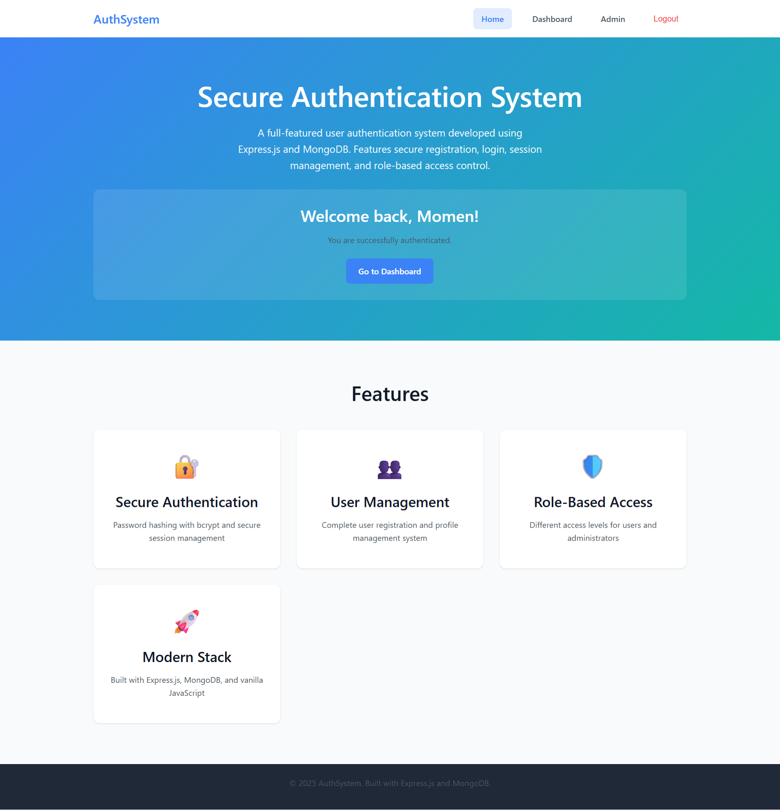

# Task 01 – Full-Stack User Authentication System



## Task Overview

Task 01 A comprehensive user authentication system built with Express.js, MongoDB, and vanilla JavaScript. Features secure registration, login, session management, and role-based access control.

## Features

- **Secure Authentication**: Password hashing with bcrypt and secure session management
- **User Management**: Complete user registration and profile management system
- **Role-Based Access Control**: Different access levels for users and administrators
- **Session Management**: Express-session with MongoDB store
- **Rate Limiting**: Protection against brute force attacks
- **Responsive Design**: Modern UI that works on all devices
- **Input Validation**: Client-side and server-side validation
- **Security Headers**: Helmet.js for security headers

## Tech Stack

- **Backend**: Node.js, Express.js
- **Database**: MongoDB with Mongoose
- **Authentication**: bcryptjs, express-session
- **Security**: Helmet, express-rate-limit, CORS
- **Frontend**: Vanilla HTML, CSS, JavaScript
- **Session Store**: connect-mongo

## Installation

1. **Clone the repository**
   ```bash
   git clone <repository-url>
   cd auth-system
   ```

2. **Install dependencies**
   ```bash
   npm install
   ```

3. **Set up environment variables**
   ```bash
   cp .env.example .env
   ```
   
   Update the `.env` file with your configuration:
   ```
   PORT=3000
   MONGODB_URI=mongodb://localhost:27017/authdb
   SESSION_SECRET=your-very-secure-session-secret
   ```

4. **Start MongoDB**
   Make sure MongoDB is running on your system.

5. **Run the application**
   ```bash
   # Development mode with nodemon
   npm run dev
   
   # Production mode
   npm start
   ```

## Usage

### Registration
- Navigate to `/register`
- Fill in username, email, and password
- Password must be at least 6 characters long
- Username must be 3-30 characters long

### Login
- Navigate to `/login`
- Use email or username with password
- Sessions are maintained for 24 hours

### Dashboard
- Access `/dashboard` after logging in
- View profile information and account statistics
- Edit profile information
- View recent activity

### Admin Panel
- Available to users with admin role
- Access `/admin` to view system statistics
- Manage user accounts and view user activity

## API Endpoints

### Authentication Routes (`/api/auth`)
- `POST /register` - User registration
- `POST /login` - User login
- `POST /logout` - User logout
- `GET /me` - Get current user information
- `GET /status` - Check authentication status

### Protected Routes (`/api/protected`)
- `GET /dashboard` - Dashboard data (requires auth)
- `GET /admin` - Admin panel data (requires admin role)
- `GET /profile` - User profile (requires auth)
- `PUT /profile` - Update user profile (requires auth)

## Security Features

- **Password Hashing**: Bcrypt with 12 salt rounds
- **Session Security**: Secure, HTTP-only cookies
- **Rate Limiting**: 5 auth attempts per 15 minutes per IP
- **Input Validation**: Server-side validation for all inputs
- **SQL Injection Protection**: Mongoose ODM prevents injection
- **XSS Protection**: Helmet.js security headers
- **CSRF Protection**: Session-based authentication

## File Structure

```
├── server.js              # Main server file
├── config/
│   └── database.js         # Database connection
├── models/
│   └── User.js            # User model with Mongoose
├── middleware/
│   └── auth.js            # Authentication middleware
├── routes/
│   ├── auth.js            # Authentication routes
│   └── protected.js       # Protected routes
├── public/
│   ├── index.html         # Home page
│   ├── login.html         # Login page
│   ├── register.html      # Registration page
│   ├── dashboard.html     # User dashboard
│   ├── admin.html         # Admin panel
│   ├── css/
│   │   └── style.css      # Main stylesheet
│   └── js/
│       ├── auth.js        # Authentication utilities
│       └── dashboard.js   # Dashboard functionality
└── package.json
```

## User Roles

### User Role
- Access to dashboard
- Profile management
- View own account information

### Admin Role
- All user permissions
- Access to admin panel
- View system statistics
- View all user accounts (limited)

## Development

### Adding New Features
1. Create new routes in the appropriate route file
2. Add middleware for authentication/authorization
3. Update frontend JavaScript for API calls
4. Add new HTML pages if needed

### Database Schema
The User model includes:
- `username`: Unique identifier for the user
- `email`: User's email address (unique)
- `password`: Hashed password
- `role`: 'user' or 'admin'
- `isActive`: Account status
- `createdAt`: Account creation date
- `lastLogin`: Last login timestamp

## Production Deployment

1. **Environment Variables**
   - Set strong `SESSION_SECRET`
   - Use production MongoDB URI
   - Set `NODE_ENV=production`

2. **Security Considerations**
   - Use HTTPS in production
   - Set secure session cookies
   - Configure proper CORS origins
   - Use environment-specific rate limits

3. **MongoDB**
   - Use MongoDB Atlas or dedicated MongoDB server
   - Set up proper indexes for performance
   - Configure backups

## Contributing

1. Fork the repository
2. Create a feature branch
3. Make your changes
4. Add tests if applicable
5. Submit a pull request

## License

This project is licensed under the MIT License.

---

🎓 Internship Program Prodigy InfoTech  
📅 Task 01 – Full-Stack User Authentication System  
🚀 Intern Momen Kelany
